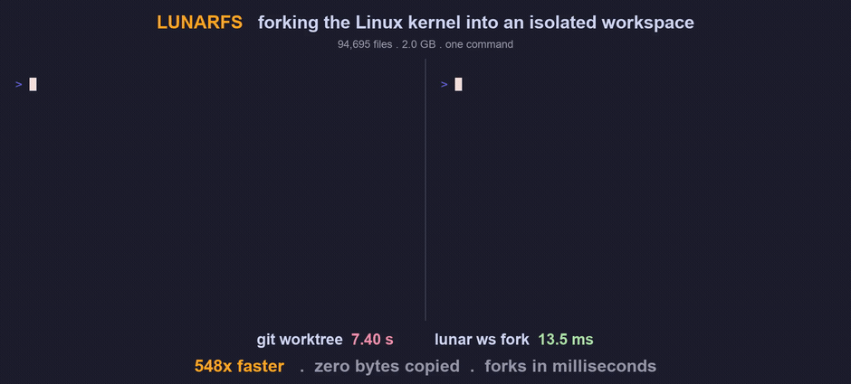

<div align="center">

<h1>🌙 LunarFS</h1>

<h3>An instant, disposable copy of your repo for every agent</h3>

Fork a workspace in milliseconds with zero bytes copied. Mount it instantly, hydrate
files lazily on first read, throw it away whenever, and keep the diff.
A BLAKE3 content-addressed store underneath.

[](LICENSE)
[](https://www.rust-lang.org/)
[](https://discord.gg/j7W6KdXxkj)

<br />



<br /><br />

**[Website](https://lunarfs.com)** &nbsp;·&nbsp; **[Discord](https://discord.gg/j7W6KdXxkj)** &nbsp;·&nbsp; **[Quickstart](#quickstart)**

</div>

## What it is

LunarFS is a BLAKE3 content-addressed object store combined with a copy-on-write
overlay and a lazy mount. Every unique blob is stored exactly once, keyed by its
hash. Forking a workspace copies only the root ref (a 32-byte hash), so the fork is
O(1) regardless of repo size. When you mount a fork, the directory tree appears
instantly with no data transferred; individual files stream from the store on first
read. That makes it practical to run N isolated agent workspaces over the same repo
at once, each starting in milliseconds, each independent.

## Install

```bash
curl --proto '=https' --tlsv1.2 -LsSf https://lunarfs.com/install.sh | sh
```

Or build from source:

```bash
git clone https://github.com/Emotions-Research/LunarFS && cd LunarFS
cargo build --release
```

`lunar mount` uses the operating system's built-in NFS client, so on macOS and Linux
there is nothing extra to install.

## Quickstart

```bash
# Ingest a repo into the local store; prints the BLAKE3 root hash
ROOT=$(lunar ingest /path/to/repo)

# Fork an isolated workspace: O(1), zero bytes copied, ~13ms
lunar ws fork --from "$ROOT" --label agent-1

# Mount it; the tree appears instantly, files hydrate on first read
lunar mount /path/to/repo ~/mnt/agent-1

# When you are done, drop the workspace
lunar ws destroy agent-1
```

## Benchmark

Forking the Linux kernel (94,695 files, 2.0 GB):

| Operation | LunarFS | git |
|---|---|---|
| Fork a workspace | `lunar ws fork` **13 ms** | `git worktree add` **7.4 s** |

The fork is **O(1)**, it copies the root ref, not the bytes, so the gap grows with
repo size and with the number of workspaces.

## Agents and MCP

LunarFS was built for agent fleets: spin up N isolated workspaces, each in
milliseconds, each from the same snapshot. The MCP server exposes it to any
MCP-compatible agent or IDE:

```bash
npx lunarfs-mcp
```

| Tool | What it does |
|---|---|
| `fork_workspace` | Fork a workspace into a new isolated copy (O(1)) |
| `mount` | Mount a workspace at a local path |
| `list_workspaces` | List workspaces visible to the current credentials |
| `push` | Persist a workspace and produce a revision |
| `grant_access` | Grant another principal read or write access |
| `destroy` | Destroy a workspace and free the ref |

## Per-agent diffs

Run many agents in parallel, each in its own fork, and see exactly what each one
changed. Because every workspace is a content-addressed tree, a diff walks only
what actually changed (O(changed), not O(repo)).

```bash
# What did this agent change since it forked?
lunar diff agent-1

# All agents at once, grouped by their shared base, with overlaps flagged
lunar ws diff
```

```
agent-1 (2 changed):   A src/feature.rs   M README.md
agent-2 (2 changed):   A src/parser.rs    M README.md

OVERLAPS (who stepped on whom)
README.md  <- agent-1, agent-2
```

See [docs/diff.md](docs/diff.md).

## Mounts

By default `lunar mount` serves the workspace over the OS's built-in NFS client,
no kernel extension or third-party driver. See [docs/mount.md](docs/mount.md) for
details and the optional FUSE-T backend.

## Sync across machines

`lunar sync <workspace> <dir>` watches a directory and pushes changes
automatically (debounced), so edits propagate without a manual `push`, and a
second machine pointed at the same workspace converges on its own. The hosted
service at [lunarfs.com](https://lunarfs.com) runs the server side for you.

## Community

Questions, demos, and ideas: [Discord](https://discord.gg/j7W6KdXxkj).

## License

The engine is AGPL-3.0; the MCP client is Apache-2.0. See [LICENSING.md](LICENSING.md).
